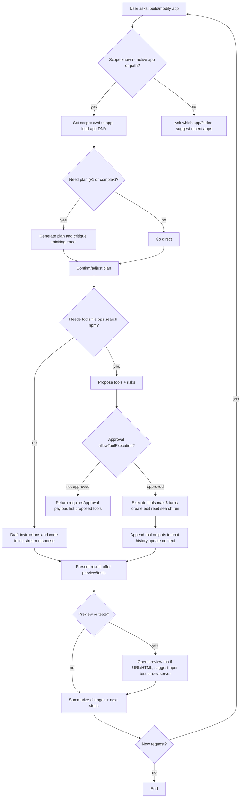

# AI Chat Capabilities

## Comparison

| Capability | This system | OpenAI ChatGPT (hosted) | Anthropic Claude (hosted) | Google Gemini (hosted) | GitHub Copilot Chat (IDE) | LangGraph/LangChain Agents | AutoGPT/CrewAI |
| --- | --- | --- | --- | --- | --- | --- | --- |
| Tool calling | Gemini-based streaming + fallback; per-agent tool scopes; multi-turn up to 6; approval gating available | Function calling; provider policies guide tool choice | Function/tool use with safety steering | Function calling; provider policies guide tool choice | IDE-scoped actions; no arbitrary external tools | Tool calling depends on agent config | Tool calling depends on agent config |
| Streaming | SSE with thinking trace parsing; fallback non-streaming | Yes (tokens) | Yes (tokens) | Yes (tokens) | Yes in-IDE | Depends on hosting/runtime | Depends on hosting/runtime |
| Thought visibility | Extracts `<thinking>`/```thinking```; UI toggle | Hidden | Hidden | Hidden | Hidden | Framework-dependent | Framework-dependent |
| Context sources | Files, folders, active app DNA, session history, attached files; tool outputs re-fed | Message window + uploads | Message window + uploads | Message window + uploads | Workspace buffers/files | Memory + tool context + external stores | Memory + tool context + external stores |
| Auto-actions | Auto-open preview for created HTML/URLs; auto-attach created files/folders | None | None | None | May open files/locations | Agent-defined | Agent-defined |
| Safety/approval | Approval prompts in fallback; streaming `allowToolExecution` gate; tool list filtered to registry | Provider safety; no per-request approval gate | Provider safety; constitutional rules | Provider safety; no per-request approval gate | IDE permission model | Framework-defined policies | Framework-defined policies |
| Model routing | Configurable model id; fast default; per-request override | Provider managed | Provider managed | Provider managed | Fixed backend | Configurable per agent | Configurable per agent |
| Prompting/skills | Active prompt set defines tool scope; slash commands (/v1, etc.) | System prompts only | System prompts only | System prompts only | Minimal prompt control | Prompt templates + tool schemas | Prompt templates + role-based agents |
| Observability | Activity log hooks; tool badges; stream progress | Not exposed | Not exposed | Not exposed | IDE notifications | Depends on tracing/telemetry | Depends on tracing/telemetry |
| Execution sandbox | Server-side tool executor; file and dev tasks | N/A (hosted) | N/A (hosted) | N/A (hosted) | IDE-only actions | Depends on deployment | Depends on deployment |

## Conversational Flow (app dev: Vite/Next.js)



## Enhancement Plan

### Phase 1: Safety + Control (short term)

| Goal | Change | Impact | Owner | Status |
| --- | --- | --- | --- | --- |
| Consistent approvals | Expose `allowToolExecution` toggle in UI and persist per session | Prevents unintended tool runs | FE + BE | Planned |
| Safer tool list | Enforce registry-only tools everywhere (stream + fallback) | Reduces invalid tool calls | BE | Done |
| Tool risk tiers | Tag tools by risk level and auto-require approval for high-risk tools | Safer ops; better UX | BE | Planned |

Details:

1. UI toggle + persistence
    - Add a per-session toggle in the AIChat settings modal.
    - Persist to session metadata and restore on load.
    - Default to allow tools for existing sessions; new sessions inherit last value.
2. Risk tiering
    - Extend tool metadata with `risk: low | medium | high` in the tool registry.
    - If `risk=high`, force approval regardless of the global toggle.
3. Approval UX
    - When approval is needed, show a short confirmation block listing tools and risk.
    - Add a one-click “Allow once” and “Always allow for session” option.
4. Acceptance tests
    - Stream: tool proposal returns `requiresApproval` when disallowed.
    - Fallback: tools gated the same way.
    - High-risk tools always ask.

### Phase 2: Reliability + UX (mid term)

| Goal | Change | Impact | Owner | Status |
| --- | --- | --- | --- | --- |
| Stream resilience | Add retry/backoff for transient stream errors | Fewer dropped responses | BE | Planned |
| Better status | Stream status updates to UI (tool start/finish) | Clearer progress | FE + BE | Planned |
| Preview control | Add explicit preview toggle when URL detected | Avoid surprise opens | FE | Planned |

Details:

1. Stream retry policy
    - Retry transient network errors once with exponential backoff.
    - Abort on explicit tool errors or max timeout.
    - Preserve partial text on retry to avoid duplication.
2. Status events
    - Emit `status` events for tool start/finish in the stream.
    - Render a compact timeline under the message (tool name + elapsed time).
3. Preview toggle
    - Add a user setting: “Auto-open preview links.”
    - If off, show a button to open preview manually.
4. Acceptance tests
    - Simulated stream failure recovers without message loss.
    - Status events render in order with correct labels.

### Phase 3: Intelligence + Scale (long term)

| Goal | Change | Impact | Owner | Status |
| --- | --- | --- | --- | --- |
| Context budget | Token-aware file selection and truncation | Better responses, lower cost | BE | Planned |
| Tool routing | Dynamic tool selection by task type and agent | Faster, more accurate tools | BE | Planned |
| Observability | Trace IDs per tool call + session analytics | Debugging and quality metrics | BE | Planned |

Details:

1. Context budgeter
    - Add a token estimator and a max context budget per model.
    - Rank files by relevance (recency, mentions, explicit attachments).
    - Truncate large file contents with summaries.
2. Tool routing
    - Classify intent (code edit, search, run, summarize) before tool selection.
    - Use an allowlist per intent and per agent prompt set.
3. Observability
    - Generate a trace ID per message and per tool call.
    - Log tool latency, success, and affected files.
    - Add a lightweight session metrics view (avg latency, tool usage).
4. Acceptance tests
    - Budgeter never exceeds model token limit.
    - Tool routing selects from the correct allowlist.
